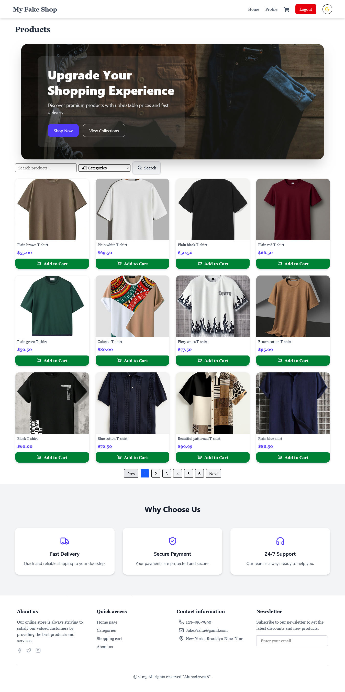
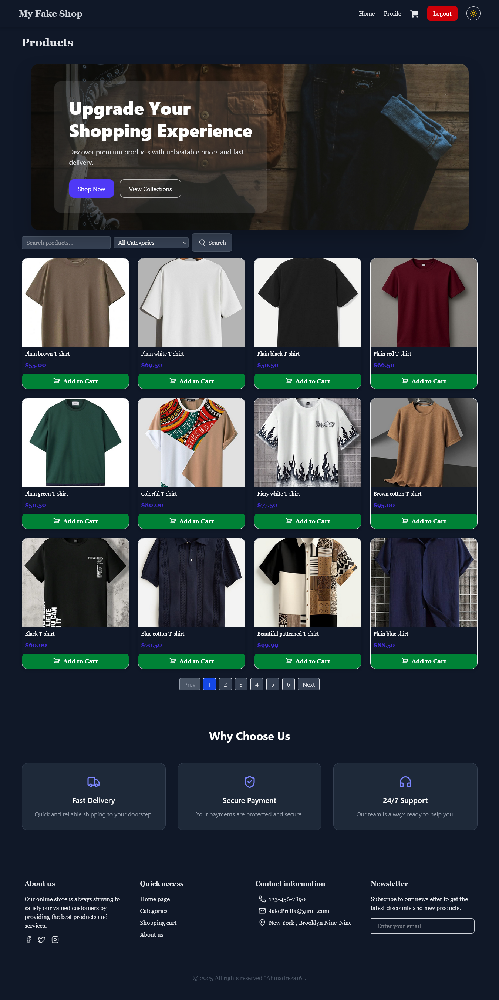
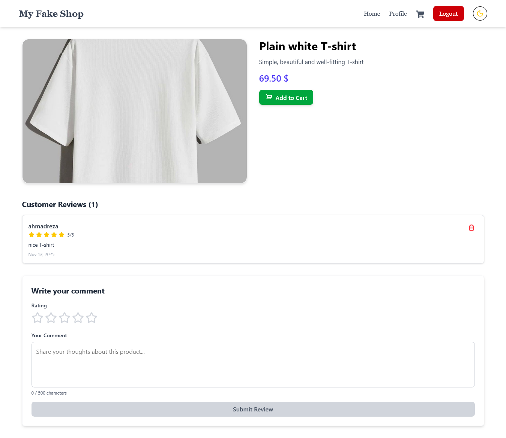
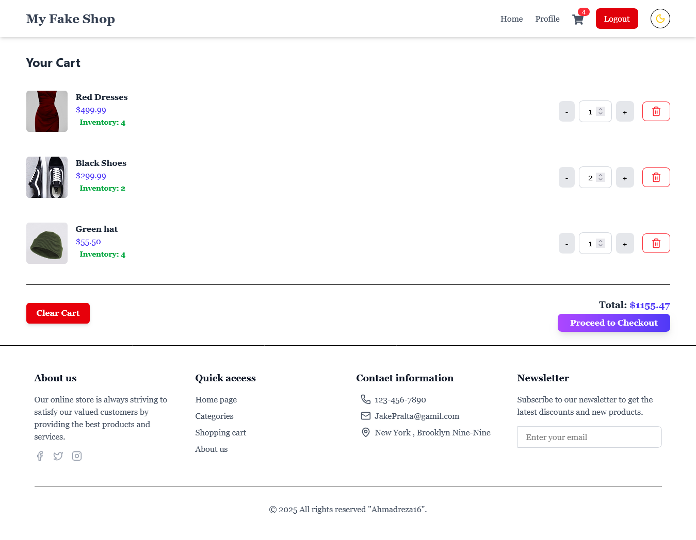

# 🛍️ Full-Stack E-commerce Website

A complete **E-commerce web application** built with **React (Frontend)** and **Django REST Framework (Backend)**.  
This project demonstrates a modern, scalable structure for building real-world online stores with authentication, payments, and reviews.

---

## 🚀 Tech Stack

### 🧠 Backend (Django)

- Django & Django REST Framework
- JWT Authentication (djangorestframework-simplejwt)
- PostgreSQL / SQLite (configurable)
- Django CORS Headers
- Apps:
  - **users** → authentication, registration, profiles
  - **products** → product listing, details, categories
  - **cart** → shopping cart management
  - **orders** → order creation, tracking, and status
  - **payments** → simulated or real payment gateway integration
  - **reviews** → user reviews and ratings

### 💻 Frontend (React + Tailwind)

- React 18 (Vite setup recommended)
- React Router DOM
- Context API (for Auth & Cart management)
- Axios for API requests
- Tailwind CSS for styling
- Lucide-react icons

---

## ⚙️ Setup & Installation

### 🖥️ Backend

```bash
cd backend
cd ecommerce
python -m venv venv
source venv/bin/activate   # or venv\Scripts\activate on Windows
pip install -r requirements.txt
python manage.py migrate
python manage.py runserver
```

### Frontend

cd frontend
cd ecommerce-frontend
npm install
npm run dev

🔑 Environment Variables
Django (.env)

SECRET_KEY=your_secret_key
DEBUG=True
DATABASE_URL=sqlite:///db.sqlite3
CORS_ALLOWED_ORIGINS=http://localhost:5173

React (.env)
VITE_API_BASE_URL=http://localhost:8000/api

🧰 Features

✅ User Authentication (JWT Login/Register)
✅ Product Listing & Search
✅ Shopping Cart (Persistent via Context)
✅ Order Creation & Tracking
✅ Simulated Payment Flow
✅ Review & Rating System
✅ Responsive UI with Tailwind CSS

🧪 Future Improvements

- Integrate a real payment gateway (e.g., Stripe)
- Admin dashboard for managing orders and products
- Multi-language support (English / Persian)

🧑‍💻 Author
Developed by Ahmadreza16
Built with ❤️ using React + Django.

---

## 📸 Preview



---

## Dark Mode



---



---

## 

---


---


---
